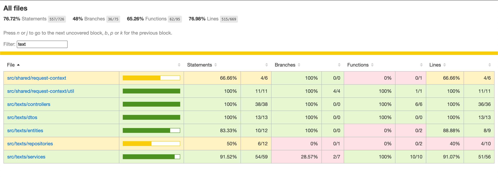

## Text Analyzer App

[](https://github.com/DevTanvir/text-analyzer-app/actions/workflows/build-workflow.yml)
[](https://github.com/DevTanvir/text-analyzer-app/actions/workflows/tests-workflow.yml)

Text analyzing app capable of performing various string based operations, with Auth and User module.

This app has the following outline:

- Monolithic Project
- REST API
- API Caching
- API Throttling
- SSO
- Swagger UI
- Dockerized


## Overview

For building this app I've used an OSS template in which I am a core contributor. This is a fast and light-weight template for starting new nodejs projects with nestjs framework. 
Following the TDD method, I've added unit-tests, and developed feature onwards. I've also added Redis caching, Nests API Throttling and Google SSO to this project. Github Actions are include as well. I used Watson for logging every requests on the server-side console. Attached Test-coverage report.

What I couldn't add:

- Log visualization with AWS Cloudwatch. I tried to connect my existing logging system Watson with AWS Cloudwatch but for some payment related issue, I was unable to integrate it. AWS would not let me access cloudwatch.


Moving forward!

Below are all the steps necessary to run the app locally, I would prefer only the Docker steps, but you can run it without docker as well. Please contact me at tanveer.cyborg@gmail.com for any questions or clarifications. 

## Installation

Note: when using docker, all the `npm` commands can also be performed using `./scripts/npm` (for example `./scripts/npm install`).

This script allows you to run the same commands inside the same environment and versions than the service, without relying on what is installed on the host.

OK start with this command first.

```bash
$ npm install
```

Create a `.env` file from the template `.env.template` file which you can find on the root directory.

Generate PUBLIC and PRIVATE key pair for jwt authentication:

### With docker

Run this command:

```bash
./scripts/generate-jwt-keys
```

It will output something like this. You only need to add it to your `.env` file.

```
To setup the JWT keys, please add the following values to your .env file:
JWT_PUBLIC_KEY_BASE64="(long base64 content)"
JWT_PRIVATE_KEY_BASE64="(long base64 content)"
```

NOTE: if you are on a windows OS you might need extra steps to convert these jwt keys to base64 content. (e.g. you can use git bash to covert the keys)

### Without docker

```bash
$ ssh-keygen -t rsa -b 2048 -m PEM -f jwtRS256.key
# Don't add passphrase
$ openssl rsa -in jwtRS256.key -pubout -outform PEM -out jwtRS256.key.pub
```

You may save these key files in `./local` directory as it is ignored in git.

Encode keys to base64:

```bash
$ base64 -i local/jwtRS256.key

$ base64 -i local/jwtRS256.key.pub
```

Must enter the base64 of the key files in `.env`:

```bash
JWT_PUBLIC_KEY_BASE64=BASE64_OF_JWT_PUBLIC_KEY
JWT_PRIVATE_KEY_BASE64=BASE64_OF_JWT_PRIVATE_KEY
```
NOTE: if you are on a windows OS you might need extra steps to convert these jwt keys to base64 content. (e.g. you can use git bash to covert the keys)

## Running the app

We can run the project with or without docker. (docker preferred)


### Docker

```bash
# build image
$ docker build -t text-analyzer-app .

# run container from image
$ docker run -p 3000:3000 --volume 'pwd':/usr/src/app --network --env-file .env text-analyzer-app

# run using docker compose
$ docker compose up
```

After the server starts go to your browser and type-in localhost:3000/swagger. There you can see the list of APIs to be used. but before that you need to run migrations! check below for migrations steps.


### Local

NOTE: To run the server without Docker we need this pre-requisite:

- Postgres server running

Commands:

```bash
# development
$ npm run start

# watch mode
$ npm run start:dev

```

After the server starts go to your browser and type-in localhost:3000/swagger. There you can see the list of APIs to be used. but before that you need to run migrations! check below for migration steps.


## Migrations

To run the migration files use the below commands.

```bash
# using docker
$ docker compose exec app npm run migration:run

# run migration
$ npm run migration:run

# to revert any migration
$ npm run migration:revert
```

## Single Sign On (SSO) Strategy

To use single sign on feature, while the server is running, click <a href="http://localhost:3000/api/v1/auth/google" target="blank">SSO</a> to trigger the Google Authentication system.


## Test

```bash
# unit tests
$ npm run test

# to run the test coverage use the below command, then to see all the coverage open the html file from root-directory/coverage/lcov-report/index.tml or you can check your console as well.
$ npm run test:cov
```

## Test Coverage Report



## Architecture

- [Project Structure](./docs/project-structure.md)
